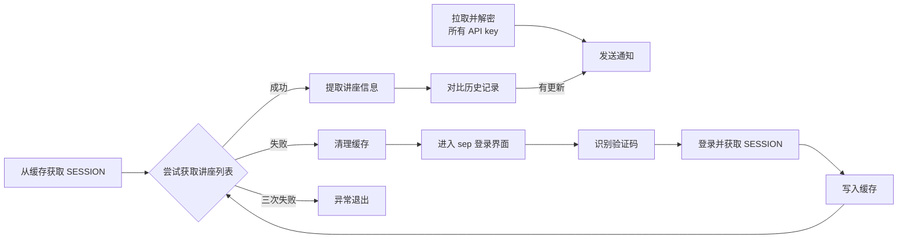
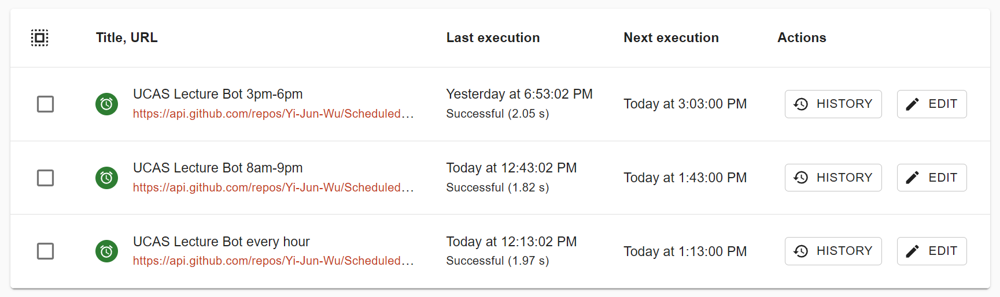
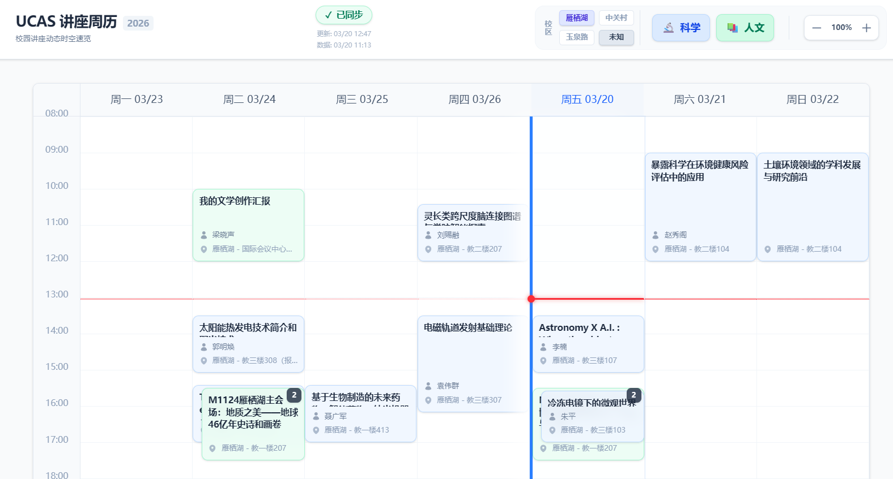

# Sep 登录认证, 自动监视人文讲座, 并进行提醒, 以及网页版讲座日历


> 本系统是定时监控UCAS人文讲座的系统, 最终目标是发送更新通知到移动设备上.

目前已开放**订阅**功能, 请移步 [Discussion](https://github.com/Yi-Jun-Wu/Scheduled-Tasks-Public/discussions/1) 回复 api key 自动完成订阅.
如果仅需要**查看未来讲座**时间, 欢迎移步[UCAS讲座周历 - 在线网站](https://yi-jun-wu.github.io/UCAS-Lectures/)

## 1. 综述

只阐述原理和代码, 别的什么我就不多说了, 总之这只是个 **提醒** 脚本, 不会执行任何操作, 请自己手动抢讲座.

基本流程是:


## 2. SEP 系统完整登录流程

<details><summary>点击展开完整的网页请求/转跳逻辑分析</summary>
### 首先进入登录界面:
```js
fetch("https://sep.ucas.ac.cn/")
```

响应标头会自动返回一个 `JSESSIONID` , 用于标记当前 session 身份, 保持认证过程中一致性.

```log
Response Header: 
Set-Cookie: JSESSIONID=XXXXXXXXXXXXXXXXXXXXXXXXXXX
```

在登陆页面的html中, 写死了登录逻辑: 当用户点击登录时, 加密用户密码, 提交表单:
我们需要从中提取出 `jsePubKey` 以手动使用 `node:crypto` 加密
```js
function sepSubmit() {
  var userName1 = $('#userName1').val();
  var pwd1 = $('#pwd1').val();
  var certCode1 = $('#certCode1').val();
  if (pwd1 == '' || pwd1 == 'null') {
    return false;
  } else {
    var jsePubKey = 'XXXXXXXXXXXXXXXXXXXXXXXXXXX';
    var encrypt = new JSEncrypt();
    encrypt.setKey(jsePubKey);
    passwordRSA = encrypt.encrypt(pwd1);
    $('#pwd').val(passwordRSA);
  }
  $('#userName').val(userName1);
  $('#certCode').val(certCode1);
  $('#sepform').submit();
}
```

验证码通过 `GET /changePic` 加载, 当点击时使用 `GET /changePic?code=${timestamp}` 返回新的图片.
请求时需同时附加 `JSESSIONID` 绑定身份.
验证码更新无额外 Javascript 逻辑, 只是在服务器绑定对应关系.

### 表单提交登录信息
向 /slogin 提交表单, 
```js
fetch("https://sep.ucas.ac.cn/slogin");
```

请求和响应的结构为:
```log
Request Header: 
Cookie: JSESSIONID=XXXXXXXXXXXXXXXXXXXXXXXXXXX
Request Body: "userName=XXXXXXXXXXXXXXXXXXXXXXXXXXX&pwd=XXXXXXXXXXXXXXXXXXXXXXXXXXX&loginFrom=&sb=sb"
# 或者有验证码时:
Request Body: "userName=XXXXXXXXXXXXXXXXXXXXXXXXXXX&pwd=XXXXXXXXXXXXXXXXXXXXXXXXXXX&loginFrom=&certCode=XXXX&sb=sb"

Response Header: 
HTTP/1.1 303
Location: /appStoreStudent
```

### sep 主页

上一步的认证通过时, 重定向到应用菜单, 使用 JSESSIONID 验证身份一致性; 认证不通过则重定向回登录页.
```js
fetch("https://sep.ucas.ac.cn/appStoreStudent");
```

请求和响应的结构为:
```log
Request Header: 
Cookie: JSESSIONID=XXXXXXXXXXXXXXXXXXXXXXXXXXX

Response Header: 
HTTP/1.1 200
```

主页是通过 React 加载的, 原始页面上仅有框架模板, 需要手动请求 XHR 资源, 以获取课程门户链接:
```js
fetch("https://sep.ucas.ac.cn/businessMenu")
```

得到类似下面的结构:
```xml
<ul>
...
<li>
...
<ul>
...
<h3>人文讲座</h3>
<a href="/portal/site/226/xs/1/1/XXXXXXXXXXXXXXXXXXXXXXXXXXX" target="_blank" class="block px-2 py-1 rounded hover:bg-gray-200">人文讲座通知</a>
<a href="/portal/site/226/xs/1/1/XXXXXXXXXXXXXXXXXXXXXXXXXXX" target="_blank" class="block px-2 py-1 rounded hover:bg-gray-200">人文讲座报名</a>
<a href="/portal/site/226/xs/1/1/XXXXXXXXXXXXXXXXXXXXXXXXXXX" target="_blank" class="block px-2 py-1 rounded hover:bg-gray-200">人文讲座出勤记录（取消报名）</a>
...
</ul>
...
</li>
...
</ul>
```

再从中手动提取出所需的 href 路径, 然后进行转跳.


### 转跳到讲座列表
```js
fetch("https://sep.ucas.ac.cn/portal/site/226/xs/1/1/XXXXXXXXXXXXXXXXXXXXXXXXXXX")
```

请求和响应的结构为:
```log
Request Header:
Cookie: JSESSIONID=XXXXXXXXXXXXXXXXXXXXXXXXXXX

Response Header:
HTTP/1.1 200
```

这是一个 html 网页, 其中包括目标地址, 在网页中通过js执行, 需要我们手动提取出来并跳转
其中包括目标地址的html结构如下:
```xml
<noscript>
  <meta http-equiv="refresh" content="0;url=https://xkcts.ucas.ac.cn:8443/login?Identity=XXXXXXXXXXXXXXXXXXXXXXXXXXX&roleId=xs&fromUrl=1&toUrl=1&sepToUrl=XXXXXXXXXXXXXXXXXXXXXXXXXXX">
</noscript>
```

登录子系统, 现在已经完成了身份认证, 不再需要 JSESSIONID 了, 使用动态的 Identity 作为认证信息.
```js
const url = /<meta http-equiv="refresh" content="0;url=(.+)">/.exec(await response.text());
// url = "https://xkcts.ucas.ac.cn:8443/login?Identity=XXXXXXXXXXXXXXXXXXXXXXXXXXX&roleId=xs&fromUrl=1&toUrl=1&sepToUrl=XXXXXXXXXXXXXXXXXXXXXXXXXXX";
fetch(url)
```

响应的结构为:
```log
Response Header:
HTTP/1.1 303
Location: /main?toUrl=1&sepToUrl=XXXXXXXXXXXXXXXXXXXXXXXXXXX
Set-Cookie: SESSION=XXXXXXXXXXXXXXXXXXXXXXXXXXX; Path=/; Secure; HttpOnly; SameSite=Lax
```

当 Identity 验证通过时, 就得到了**最重要**的 `SESSION` 作为 Cookie, 之后可以直接通过它直接获取讲座列表.

然后页面立刻自动重定向, 准备登入真正的目标 (由 `sepToUrl` 决定)
```js
fetch("https://xkcts.ucas.ac.cn:8443/main?toUrl=1&sepToUrl=XXXXXXXXXXXXXXXXXXXXXXXXXXX");
```

请求和响应的结构如下, 可以看到已经在使用 `SESSION` 作为认证信息了.
```log
Request Header:
Cookie: SESSION=XXXXXXXXXXXXXXXXXXXXXXXXXXX

Response Header:
HTTP/1.1 303
Location: /subject/lecture
```

### 进入真实路径
从 `sepToUrl` 自动重定向到固定明文路径, 同样使用 `SESSION` 认证.

```js
fetch("https://xkcts.ucas.ac.cn:8443/subject/lecture")
```
```log
Request Header:
Cookie: SESSION=XXXXXXXXXXXXXXXXXXXXXXXXXXX

Response Header:
HTTP/1.1 200
```

返回的文本就是 HTML 页面, 其中直接包含了人文讲座列表, 之后只需要从中 `提取讲座信息, 比对历史记录, 发送通知` 即可完成全部脚本.

</details>

## 3. 重要子系统

### 发送消息通知

我昨天花了接近一整天研究怎么发送短信, 结果最终失败了, 于是转而找国内的接口服务, 通过微信服务号发送通知.

#### 为什么无法发送短信
国内的短信服务商有着严格的限制, 是为了减少电信诈骗, 因此很难在没有实名认证的情况下发送.
具体而言:
1. 你可以找到一些提供短信服务的api接口, 比如 [twilio.com](https://www.twilio.com/) , 它会免费为新用户提供一定的额度. 但是, 对于正规平台, 发送短信前要先为你绑定一个号码, 你的短信都是从这个号码发送的, 而这个号码就成为了限制所在.
2. 短信内容不能为毫无意义的 `Test`, `Hello` 这种字符串, 会被服务商直接拦截拒收. 你发送不进国内. 你需要使用特殊的短信模板: `【公司名称】您的验证码是214574，该验证码5分钟内有效，请勿泄漏于他人！`, 这样才能进入审核流程.
3. 模板样式需要提前申请, 仅有符合模板的短信才能通过, 否则你会在控制台看到短信已发送, 但是信件却石沉大海了.
4. 申请模板需要提交报表 ..... ~~我有什么资质呢, 而且我又不开公司~~

#### 免费不用实名认证的工具: 
[Server Chan](https://sct.ftqq.com/)
这是 Google 给我推荐的一个老牌的工具, ~~尽管我仍感觉功能很少不太好用~~. 它可以推送到你个人的服务号通知(或企业微信等等, 但我没有)
拿到一个 Api key 后直接放到 url 中, 消息作为 searchParams 使用 POST 请求就可以推送到你的微信服务号了.

**P.S. 服务号默认的消息提醒是关闭的, 需要手动打开消息提醒, 这样当触发通知时, 可以第一时间得知**

### 验证码识别

使用 `tesseract.js` 库, 在此前先使用 `sharp` 库对验证码进行预处理. tesseract 似乎集成了一个小模型, 因此相比二值化的图像, 灰阶图像的识别效果更好. 
预处理先进行一次滤波, 模糊图片中的随机线条的效应, 再选取最多数量的颜色作为背景色, 然后计算与每个像素点颜色的距离, 把距离进行映射(并clamp 到 0-255 范围), 生成灰度图像, 最后再做一次平滑彻底消除干扰线条的效果.

目前存在的问题是, 四个字母的颜色不一样, 因此到背景的距离不同, 最后生成的灰度图像四个字母的对比度也不同. 理论上可以先剪裁一下, 分区域提高对比度, 再进行识别. 并且有一些参数还是可以优化, 图像也可以先放大分辨率再处理.

**但是我没有**, 不想弄这么麻烦, 用了一个很简单的逻辑: 
> 我直接检测它的识别结果, 如果字符数量不对, 或者出现了非法字符, 就舍弃此次识别, 刷新一下验证码重来. 就算扫描结果还是错了, 也没关系, 一共有三次登录的机会, 总有一次能蒙对吧~

实际测试表明: 当终于识别出四个英文字母时, 大概率是对的. 

### 定时器
*本来我是使用 Github Action 的Schedule的, 但是会排队, 非常不稳定, 因此使用外部接口触发工作流.*

使用网上的免费的定时触发服务 [cron-job](https://cron-job.org/en/) , 结合 Github REST Api, 配合 fine-grained 令牌, 实现主动触发(**准时, 不用排队**)

#### Github 配置

将 *check-lectures.yml* 中的 `schedule: [cron...]` 删掉, 我们不用它自动触发了.

生成一个细粒度令牌, 仓库选择 Scheduled-Tasks (这是我放这个脚本的仓库名), 权限选择 Actions - Read & Write (触发工作流需要写权限, 见文档 [Repository permissions for "Actions"](https://docs.github.com/en/rest/authentication/permissions-required-for-fine-grained-personal-access-tokens?apiVersion=2026-03-10#repository-permissions-for-actions)). 到期时间选择90天(毕竟三个月后就放暑假了, 之后的事情之后再说). 复制你的令牌 `github_pat_xxxxxx`.
> 顺带一提, Github REST API 升级到 2026-3-10 版本了.

触发工作流的格式如下(参见 [Create a workflow dispatch event](https://docs.github.com/en/rest/actions/workflows?apiVersion=2026-03-10#create-a-workflow-dispatch-event)):

```sh
curl -L \
  -X POST \
  -H "Accept: application/vnd.github+json" \
  -H "Authorization: Bearer <YOUR-TOKEN>" \
  -H "X-GitHub-Api-Version: 2026-03-10" \
  https://api.github.com/repos/OWNER/REPO/actions/workflows/WORKFLOW_ID/dispatches \
  -d '{"ref":"topic-branch","inputs":{"name":"Mona the Octocat","home":"San Francisco, CA"}}'
```

#### 配置 cron-job
注册并登录, 创建一个新的 CRONJOB.
URL 填写 rest api 的路径, 加粗的部分要改成自己的: _https://api.github.com/repos/**USER**/**REPO**/actions/workflows/**check-lectures.yml**/dispatches_
然后在 Crontab expression 使用时间表达式: `3,23,33,53 16-18 * * 1-5`
切换到高级选项, 填入 Headers:
|key|value|
|---|---|
|Accept|application/vnd.github+json|
|Authorization|Bearer **github_pat_xxxxxx**|
|Content-Type|application/json|
|X-GitHub-Api-Version|2026-03-10|
并在高级选项选择 `上海` 时区, 请求方法 `POST`, 请求正文为
```json
{
  "ref": "main"
}
```

保存并测试, 可以触发Gihtub工作流

#### 完整任务:

右上角可以克隆任务, 克隆成三份, 配置为:
- **UCAS Lecture Bot 4pm-7pm**: `3,23,33,53 13-17 * * 1-5`
- **UCAS Lecture Bot 8am-9pm**: `43 8-21 * * 1-5`
- **UCAS Lecture Bot every hour**: `13 * * * *`

具体含义: 每天每小时执行一次(每小时的第13分种); 在工作日白天, 每小时再额外执行一次(第43分钟); 在工作日下午3点到6点, 每小时共执行六次(从03分开始, 每10分钟一次)



## 4. 代码和结构

### Github 项目结构

```log

Scheduled Task
│   README.md
│   .gitignore
│   package-lock.json               # ignored
│   package.json                    # ignored
│   tsconfig.json                   # ignored
│   
├───.github
│   └───workflows
│           check-lectures.yml      # 触发器位置
│           
├───check-lectures
│   │   main.ts                     # 程序入口
│   │   captcha.ts                  # 验证码识别
│   │   extract.ts                  # query 网页内容
│   │   login.ts                    # 完成登录操作, 拉取网页
│   │   notification.ts             # 发送验证码提醒
│   │   get_all_replies.ts.ts       # 获取全部api接口
│   │   decrypt_server_chan_api.ts  # 解码RSA密文(api接口)
│   │   .gitignore
│   │   
│   └───dist                        # ignored
│           
├───other_projects
```


此外, 对于访问时用到的 SESSION 与讲座系统的历史记录, 介于我不希望频繁push这个仓库, 而这个脚本却是一直运行的, 因此可以将数据放在 GitHub Actions 的缓存中, 不用担心长时间不用被清理, 也不占用仓库储存.


## 5. 后记

代码采用 MIT 协议开源

### UCAS Lectures (国科大讲座周历)

> *把数据提取出来, 配合前端, 就做成了网页版周历 app* :
https://github.com/Yi-Jun-Wu/UCAS-Lectures

项目包含中国科学院大学（UCAS）讲座信息的公开数据源，以及一个用于直观展示讲座安排的现代化 Web 周历应用。

🌐 **在线访问**: [https://yi-jun-wu.github.io/UCAS-Lectures/](https://yi-jun-wu.github.io/UCAS-Lectures/)

[](https://yi-jun-wu.github.io/UCAS-Lectures/)
