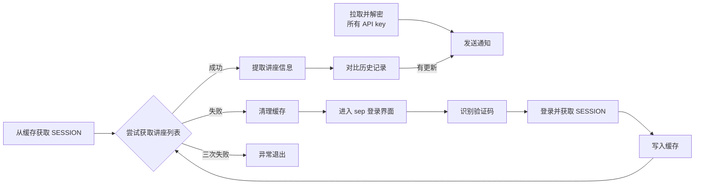

# Sep 登录认证, 自动监视人文讲座, 并进行提醒, 以及网页版讲座日历

本系统是定时监控UCAS人文讲座的系统, 最终目标是发送更新通知到移动设备上.
目前已开放订阅功能, 请移步 Discussion 

## 1. 综述

只阐述原理和代码, 别的什么我就不多说了, 总之这只是个 **提醒** 脚本, 不会执行任何操作, 请自己手动抢讲座.

基本流程是:

```mermaid
graph LR
    A[从缓存获取 SESSION] --> B{尝试获取讲座列表}
    
    B -- 成功 --> C[提取讲座信息]
    C --> D[对比历史记录]
    L[拉取并解密<br/>所有 API key] --> E
    D -- 有更新 --> E[发送通知]

    
    B -- 失败 --> F[清理缓存]
    F --> G[进入 sep 登录界面]
    G --> H[识别验证码]
    H --> I[登录并获取 SESSION]
    I --> J[写入缓存]
    J --> B

    B -- 三次失败 --> K[异常退出]
```